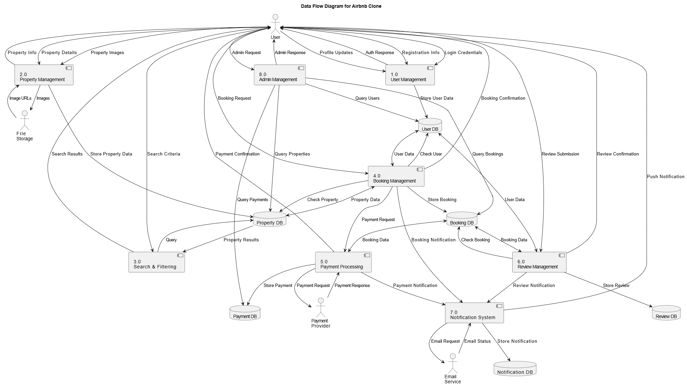

# Data Flow Diagram

This directory contains the Data Flow Diagram (DFD) for the Airbnb Clone project, illustrating how data moves through the system.

## Overview

The Data Flow Diagram below maps the flow of information between external entities, processes, and data stores within the system. This diagram helps visualize how data is processed, stored, and transmitted throughout the application.

## Components

### External Entities
- **User**: End users of the system (guests, hosts, admins)
- **Payment Provider**: External payment processing service
- **Email Service**: External email delivery service
- **File Storage**: External service for storing images and files

### Processes
1. **User Management**: Handles user registration, authentication, and profile updates
2. **Property Management**: Manages property listings creation and updates
3. **Search & Filtering**: Processes property search queries and filters
4. **Booking Management**: Handles booking creation and management
5. **Payment Processing**: Manages payment transactions
6. **Review Management**: Handles review submission and display
7. **Notification System**: Manages communication with users
8. **Admin Management**: Handles administrative functions

### Data Stores
1. **User DB**: Stores user information
2. **Property DB**: Stores property listing details
3. **Booking DB**: Stores booking information
4. **Payment DB**: Stores payment transactions
5. **Review DB**: Stores user reviews
6. **Notification DB**: Stores notification records

## Key Data Flows

- User registration and authentication data
- Property creation and update information
- Search criteria and results
- Booking requests and confirmations
- Payment transactions
- Review submissions
- Notifications across various channels

## Implementation Considerations

When implementing features based on this data flow diagram:
- Ensure proper data validation at each process
- Implement secure communication between components
- Design efficient database schemas based on data store requirements
- Consider caching strategies for frequently accessed data
- Plan for data consistency across related processes
