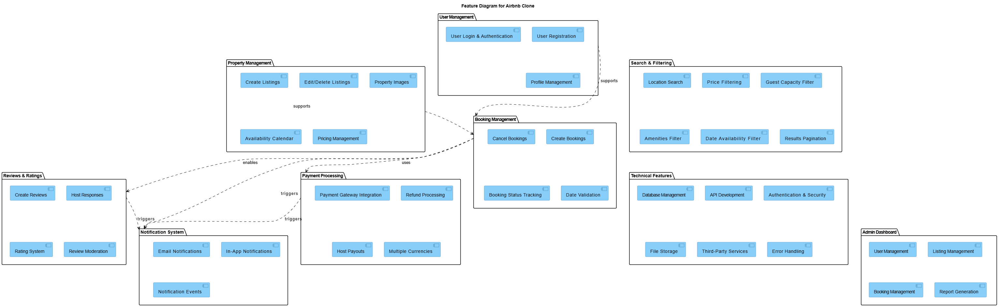

# Airbnb Clone Project: Features and Functionalities

## Overview
This document outlines the key features and functionalities required for the backend of the Airbnb Clone project. The backend will support various operations essential for a rental marketplace, including user management, property listings, bookings, payments, and reviews.

The diagram below illustrates the key features and their relationships within the system. These features represent the fundamental capabilities required for a rental marketplace platform.

## 1. Core Features and Functionalities

### 1.1 User Management
- **User Registration**
  - Sign up as guest or host
  - Secure authentication with JWT
  - Email verification
  
- **User Login and Authentication**
  - Login via email and password
  - OAuth integration (Google, Facebook)
  - Password reset functionality
  
- **Profile Management**
  - Update personal information
  - Upload and manage profile photos
  - Manage contact information and preferences
  - View booking history

### 1.2 Property Listings Management
- **Create Listings**
  - Add property details (title, description)
  - Set location information
  - Upload property photos
  - Define pricing
  - List amenities
  - Set availability calendar
  
- **Manage Listings**
  - Edit existing listings
  - Delete listings
  - Update availability
  - Temporarily disable listings

### 1.3 Search and Filtering
- **Search Properties**
  - Search by location
  - Filter by price range
  - Filter by guest capacity
  - Filter by amenities
  - Filter by availability dates
  
- **Results Management**
  - Implement pagination
  - Sort by relevance, price, ratings
  - View properties on map

### 1.4 Booking Management
- **Create Bookings**
  - Select dates
  - Specify number of guests
  - Prevent double bookings
  - Calculate total price including fees
  
- **Manage Bookings**
  - View booking details
  - Cancel bookings
  - Modify booking dates (if allowed)
  - Track booking status (pending, confirmed, canceled, completed)

### 1.5 Payment Processing
- **Process Payments**
  - Secure payment gateway integration (Stripe/PayPal)
  - Handle upfront payments
  - Process refunds for cancellations
  - Automatic payouts to hosts
  
- **Financial Management**
  - Multiple currency support
  - Tax calculation
  - Service fee calculation
  - Payment history

### 1.6 Reviews and Ratings
- **Create Reviews**
  - Rate properties (star rating)
  - Leave written feedback
  - Upload photos with reviews
  
- **Manage Reviews**
  - Host responses to reviews
  - Report inappropriate reviews
  - Display average ratings

### 1.7 Notification System
- **Send Notifications**
  - Email notifications
  - In-app notifications
  - Push notifications (optional)
  
- **Notification Events**
  - Booking confirmations
  - Booking cancellations
  - Payment updates
  - New messages
  - Review reminders

### 1.8 Admin Dashboard
- **User Management**
  - View and manage users
  - Suspend accounts
  - Handle user reports
  
- **Content Management**
  - Monitor and moderate listings
  - Review reported content
  
- **System Analytics**
  - Track bookings and revenue
  - Monitor system performance
  - Generate reports

## 2. Technical Features

### 2.1 Database Management
- Relational database implementation (PostgreSQL/MySQL)
- Efficient schema design
- Database optimization

### 2.2 API Development
- RESTful API architecture
- Proper HTTP methods and status codes
- API documentation
- Rate limiting

### 2.3 Authentication and Security
- JWT implementation
- Role-based access control
- Data encryption
- Input validation

### 2.4 File Storage
- Cloud storage for images
- File type validation
- Image optimization

### 2.5 Third-Party Integrations
- Email service integration
- Payment gateway integration
- OAuth providers

### 2.6 Error Handling
- Global error handling
- Detailed error logging
- User-friendly error messages

## 3. Non-Functional Features

### 3.1 Scalability
- Modular architecture
- Horizontal scaling capability
- Load balancing

### 3.2 Security
- Data encryption
- Firewall implementation
- CSRF protection
- Rate limiting

### 3.3 Performance
- Caching mechanisms
- Query optimization
- Response time optimization

### 3.4 Testing
- Unit testing
- Integration testing
- API testing
- Load testing

