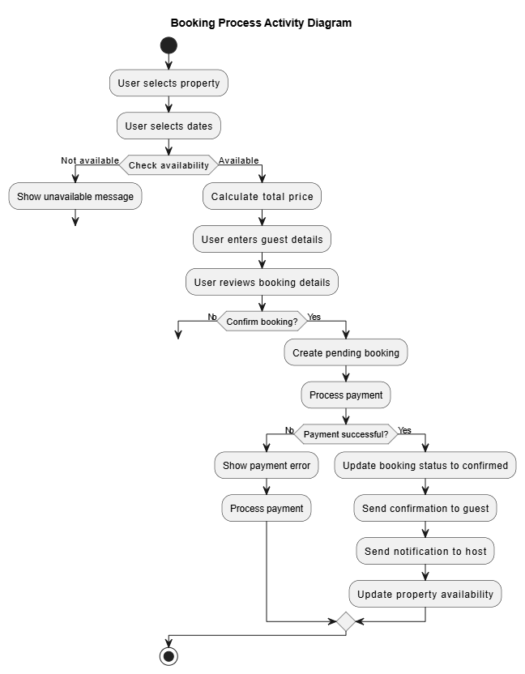

# System Process Flowcharts

This directory contains flowcharts visualizing key system processes for the Airbnb Clone project.

## Overview

Flowcharts provide step-by-step visualization of important processes within the system. They help understand the sequence of operations, decision points, and data flow within specific features.

## Property Booking Process

The booking process flowchart illustrates the steps involved when a guest books a property, from selecting dates to confirmation.

### Process Description

1. **Property Selection**: User selects a property they're interested in
2. **Date Selection**: User selects desired check-in and check-out dates
3. **Availability Check**: System verifies if the property is available for the selected dates
4. **Price Calculation**: System calculates the total price including all fees
5. **Guest Details**: User enters the number of guests and any special requests
6. **Booking Review**: User reviews all booking details before confirming
7. **Payment Processing**: System processes the payment
8. **Confirmation**: Upon successful payment, booking is confirmed
9. **Notifications**: System sends confirmations to both guest and host
10. **Availability Update**: Property's availability calendar is updated

## Implementation Considerations

When implementing features based on these flowcharts:
- Handle edge cases at each decision point
- Implement proper error handling and user feedback
- Ensure data consistency throughout the process
- Design for potential process interruptions and resumption
- Consider performance optimization for critical paths

Additional flowcharts can be added to this directory as needed for other key processes:
- User registration flow
- Property listing creation
- Review submission process
- Payment processing
- Booking cancellation
