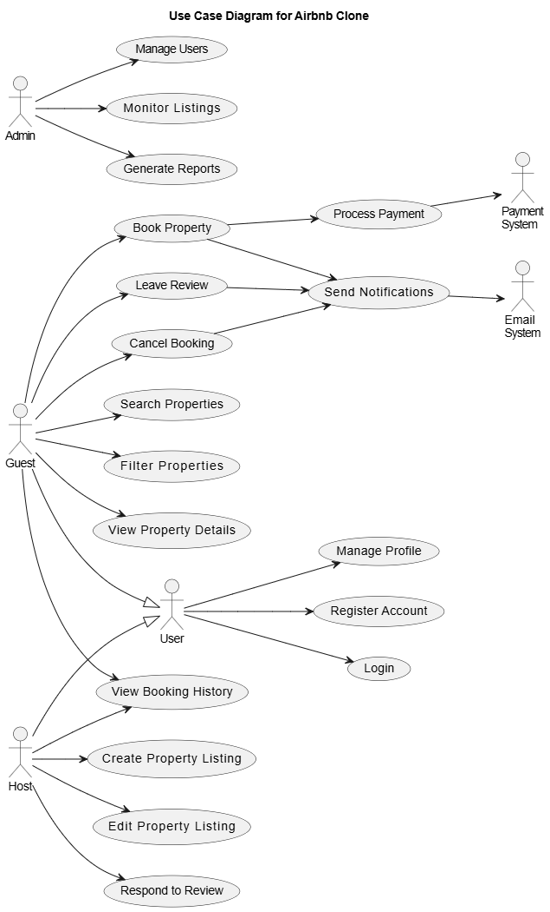

# Use Case Diagram

This directory contains the use case diagram for the Airbnb Clone project, illustrating the interactions between users and the system.

## Overview

The use case diagram below visualizes how different actors (Guest, Host, Admin, etc.) interact with the system's key functionalities. This diagram serves as a foundation for understanding user requirements and system behavior.

## Actors

The system involves the following actors:

- **User**: General user of the system (parent of Guest and Host)
- **Guest**: User who searches for and books properties
- **Host**: User who lists and manages properties
- **Admin**: System administrator with elevated privileges
- **Payment System**: External payment processing service
- **Email System**: External email service for notifications

## Key Use Cases

### User Authentication & Profile
- Register Account
- Login
- Manage Profile

### Host Operations
- Create Property Listing
- Edit Property Listing
- Respond to Review
- View Booking History

### Guest Operations
- Search Properties
- Filter Properties
- View Property Details
- Book Property
- Cancel Booking
- Leave Review
- View Booking History

### Admin Operations
- Manage Users
- Monitor Listings
- Generate Reports

### System Operations
- Process Payment
- Send Notifications

## Relationships

- Users can be either Guests or Hosts (inheritance relationship)
- Booking a property triggers payment processing
- Various actions (booking, cancellation, reviews) trigger notifications

## Implementation Considerations

When implementing features based on this use case diagram:
- Prioritize core user flows (registration, property listing, booking)
- Ensure proper role-based access control
- Design for extensibility to add new use cases in the future
- Validate that all use cases have corresponding API endpoints
